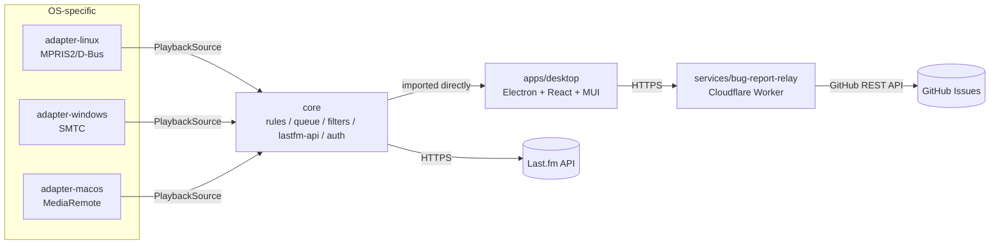

# Architecture

## Why not a foobar2000 plugin?

The direct inspiration for this project, [foo_scrobbler_mac](https://github.com/zfoxer/foo_scrobbler_mac),
is a native C++ plugin built into foobar2000 using foobar2000's own SDK. foobar2000 has
no native Linux release, so "port the plugin" cannot deliver macOS + Windows + Linux
parity. See [ADR 0001](adr/0001-standalone-os-media-session-architecture.md).

## System overview

## Packages

| Package                     | Responsibility                                                                                               | Module doc                                                 |
| --------------------------- | ------------------------------------------------------------------------------------------------------------ | ---------------------------------------------------------- |
| `packages/shared-types`     | `TrackInfo`, `PlaybackState`, `PlaybackSource` — the contract every adapter implements and `core` depends on | [modules/shared-types.md](modules/shared-types.md)         |
| `packages/core`             | Scrobble eligibility rules, offline queue, Last.fm API client, auth, exclusion filters, logging              | [modules/core.md](modules/core.md)                         |
| `packages/adapter-linux`    | MPRIS2 over D-Bus                                                                                            | [modules/adapter-linux.md](modules/adapter-linux.md)       |
| `packages/adapter-windows`  | SMTC via a helper binary                                                                                     | [modules/adapter-windows.md](modules/adapter-windows.md)   |
| `packages/adapter-macos`    | MediaRemote via a helper binary                                                                              | [modules/adapter-macos.md](modules/adapter-macos.md)       |
| `apps/desktop`              | Electron + React + MUI shell — Now Playing / Scrobbles / Profile / Friends / Preferences                     | [modules/desktop.md](modules/desktop.md)                   |
| `services/bug-report-relay` | Anonymous bug report → GitHub issue, Cloudflare Worker                                                       | [modules/bug-report-relay.md](modules/bug-report-relay.md) |

## Key decisions

See [docs/adr/](adr/) for the full reasoning behind each of these:

1. [Standalone OS-media-session architecture, not a player plugin](adr/0001-standalone-os-media-session-architecture.md)
2. [TypeScript for the engine](adr/0002-typescript-engine.md)
3. [Electron + MUI for the desktop shell](adr/0003-electron-mui-desktop-shell.md)
4. [Anonymous bug-report relay](adr/0004-anonymous-bug-report-relay.md)
5. [Multi-source and track-identity policy](adr/0005-multi-source-and-track-identity-policy.md)
6. [Offline queue persistence](adr/0006-offline-queue-persistence.md)
7. [Package-manager agnostic (pnpm, npm, Bun)](adr/0007-package-manager-agnostic.md)
