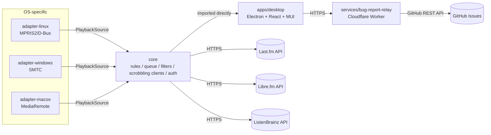

# Architecture

## Why not a foobar2000 plugin?

The direct inspiration for this project, [foo_scrobbler_mac](https://github.com/zfoxer/foo_scrobbler_mac),
is a native C++ plugin built into foobar2000 using foobar2000's own SDK. foobar2000 has
no native Linux release, so "port the plugin" cannot deliver macOS + Windows + Linux
parity. See [ADR 0001](adr/0001-standalone-os-media-session-architecture.md).

## System overview



Every adapter satisfies the same `PlaybackSource` contract
(`packages/shared-types`), so `packages/core` never knows which OS it's running on —
and every scrobbling destination (Last.fm, Libre.fm, ListenBrainz) satisfies the same
`ScrobblingClient` contract, so `apps/desktop`'s scrobbling pipeline never special-cases
which service a submission is going to. Both seams exist for the same reason: adding a
fourth OS adapter or a fourth scrobbling service should mean writing one new file that
implements an existing interface, not touching the pipeline that already works.

## Process model

`apps/desktop` is a single Electron application with three process types, per
Electron's own standard architecture:

- **Main process** (`apps/desktop/src/main/`) — plain Node.js. Owns the platform
  `PlaybackSource`, the `Tracker`, the `ScrobbleQueue`, every scrobbling client
  (Last.fm/Libre.fm/ListenBrainz), account/credential storage, settings persistence,
  the system tray, auto-update, and native notifications. **Imports `packages/core`
  directly** — no IPC boundary, no serialization, no separate backend service (see
  [ADR 0002](adr/0002-typescript-engine.md) and
  [ADR 0003](adr/0003-electron-mui-desktop-shell.md)). This is the one process where
  `packages/core`'s classes actually get instantiated; the renderer never sees them.
- **Preload script** (`apps/desktop/src/preload/`) — a narrow bridge, not a second copy
  of the app. Every capability the renderer needs crosses via
  `contextBridge.exposeInMainWorld` as a purpose-built function (`window.auth.login()`,
  `window.settings.get()`, …), never a raw Node or Electron object. See
  `docs/modules/desktop.md`'s "IPC and renderer security model" for the sender-
  validation layer on top of this and the sandboxed-preload-vs-ESM gotcha that shaped
  this file's own build configuration.
- **Renderer process** (`apps/desktop/src/renderer/`) — a normal React + MUI single-page
  app, `contextIsolation: true`/`nodeIntegration: false`, no Node access at all except
  through the preload bridge above. Five destinations (Now Playing, Scrobbles, Profile,
  Friends, Settings), each backed by a hook that calls into the preload bridge and
  degrades gracefully (never throws) when a bridge API is missing — the same behavior a
  component test sees when no real preload script is loaded.

`services/bug-report-relay` and `apps/site` are **not** part of this process model at
all — they're independently deployed (Cloudflare Workers and GitHub Pages
respectively; see "Build, test, and release pipeline" below), reached only over plain
HTTPS from the desktop app's main process (the relay) or a browser (the site).

## Repository layout

```
apps/
  desktop/     Electron + React + MUI shell — see docs/modules/desktop.md
  site/        Static HTML/CSS landing page, no build step — see docs/modules/site.md
packages/
  shared-types/    PlaybackSource contract + TrackInfo/PlaybackState — no runtime code
  core/            Scrobbling engine: rules, queue, filters, clients, auth, logging
  adapter-macos/   MediaRemote via a perl-hosted vendored helper framework
  adapter-windows/ SMTC via a compiled C# helper process
  adapter-linux/   MPRIS2 over D-Bus, pure JS
services/
  bug-report-relay/  Cloudflare Worker: anonymous bug report -> GitHub issue
scripts/
  run-workspaces.mjs  Package-manager-agnostic "run this script in every workspace"
docs/
  ARCHITECTURE.md, CONTRIBUTING.md, TESTING.md  Cross-cutting docs (this file included)
  adr/      Numbered Architecture Decision Records — the *why* behind non-obvious choices
  modules/  One doc per package/app/service above — the *what* and *how*
.github/
  workflows/   CI, CodeQL, release, Pages deploy, bug-report-relay deploy, PR auto-assign
  dependabot.yml
```

Every directory under `apps/*`, `packages/*`, and `services/*` that has a
`package.json` is an npm/pnpm/Bun workspace package (see
[ADR 0007](adr/0007-package-manager-agnostic.md)); `apps/site` deliberately doesn't
(see `docs/modules/site.md`'s "Not a workspace package"), and both `pnpm-workspace.yaml`
and root `package.json`'s `workspaces` field skip it silently rather than erroring.

## Data flow: how a play becomes a scrobble

1. A platform adapter (`adapter-macos`/`-windows`/`-linux`) detects a track change or
   playback-state change from the OS's native media-session API and reports it through
   its `PlaybackSource` interface.
2. `packages/core`'s `Tracker` (constructed once, in the main process) receives the
   event, applies the user's exclusion filter (`packages/core`'s `filters/` DSL,
   compiled from Settings → Filter) if any, and — driven by a periodic `tick()` call
   from the main process, not a timer of its own — accumulates actual played time.
3. Once `isEligibleForScrobble` returns true (≥50% played or ≥240s, whichever first;
   see `docs/modules/core.md`), `Tracker` fires `onScrobbleEligible` exactly once for
   that play.
4. `apps/desktop/src/main/scrobbling/wire-scrobbling.ts` enqueues the play into a
   `ScrobbleQueue` (SQLite, survives restarts — see
   [ADR 0006](adr/0006-offline-queue-persistence.md)), then periodically drains the
   queue and submits it to **every currently-connected scrobbling service at once**
   (Last.fm and/or Libre.fm and/or ListenBrainz — each implements the shared
   `ScrobblingClient` interface from `packages/core`, so this step doesn't special-case
   which service it's talking to). A submission that fails is retried or dropped per
   `isRetryableApiErrorCode`/`isRetryableScrobbleIgnoreCode`'s classification.
5. A successful submission fires a native OS notification if the window is hidden (see
   `docs/modules/desktop.md`'s "Native notifications"); a scrobble-eligible track also
   drives the renderer's Now Playing view over IPC in real time, independent of the
   queue/submission path above.

## Packages

| Package                     | Responsibility                                                                                               | Module doc                                                 |
| --------------------------- | ------------------------------------------------------------------------------------------------------------ | ---------------------------------------------------------- |
| `packages/shared-types`     | `TrackInfo`, `PlaybackState`, `PlaybackSource` — the contract every adapter implements and `core` depends on | [modules/shared-types.md](modules/shared-types.md)         |
| `packages/core`             | Scrobble eligibility rules, offline queue, Last.fm/Libre.fm/ListenBrainz clients, auth, exclusion filters, artist-photo lookup, logging | [modules/core.md](modules/core.md)                         |
| `packages/adapter-linux`    | MPRIS2 over D-Bus                                                                                            | [modules/adapter-linux.md](modules/adapter-linux.md)       |
| `packages/adapter-windows`  | SMTC via a helper binary                                                                                     | [modules/adapter-windows.md](modules/adapter-windows.md)   |
| `packages/adapter-macos`    | MediaRemote via a `perl`-hosted helper framework                                                             | [modules/adapter-macos.md](modules/adapter-macos.md)       |
| `apps/desktop`              | Electron + React + MUI shell — Now Playing / Scrobbles / Profile / Friends / Settings                     | [modules/desktop.md](modules/desktop.md)                   |
| `apps/site`                 | Static landing page, deployed to GitHub Pages                                                                | [modules/site.md](modules/site.md)                         |
| `services/bug-report-relay` | Anonymous bug report → GitHub issue, Cloudflare Worker                                                       | [modules/bug-report-relay.md](modules/bug-report-relay.md) |

## Build, test, and release pipeline

Full detail lives in [ADR 0007](adr/0007-package-manager-agnostic.md) (the
package-manager-agnostic build), [docs/TESTING.md](TESTING.md) (per-package test
strategy), and each module doc's own "Status"/"Deployment" sections — this is the
cross-cutting summary tying them together.

- **Local build order**: `scripts/run-workspaces.mjs` topologically sorts every
  workspace package by its `@lastfm-scrobbler/*` dependencies (so `shared-types`
  always builds before anything that imports it, and `core` before the adapters and
  `apps/desktop`) and runs the requested script (`build`/`test`/`typecheck`/`lint`/…)
  in that order, dispatching to whichever package manager actually invoked it — this is
  what `npm run build`/`pnpm build`/`bun run build` at the repo root all resolve to.
- **CI** (`.github/workflows/ci.yml`) — a 3×3 matrix (pnpm/npm/bun ×
  `ubuntu-latest`/`windows-latest`/`macos-latest`, 9 jobs) on every push to `main` and
  every PR, each running `build && typecheck && lint && test` under its own package
  manager. `ubuntu-latest` jobs additionally ensure `dbus-daemon` is installed first,
  for `adapter-linux`'s real-D-Bus smoke test. Superseded runs on the same branch/PR
  are cancelled automatically.
- **CodeQL** (`.github/workflows/codeql.yml`) — `javascript-typescript` security-and-
  quality analysis on every push to `main`, every PR, and a weekly schedule
  (independent of code changes, to pick up newly-published query rules).
- **Release** (`.github/workflows/release.yml`) — triggered by pushing a `v*` tag (or
  manually via `workflow_dispatch` for a dry run that packages but doesn't publish).
  Builds installers for all three platforms in parallel
  (`package:mac`/`package:win`/`package:linux`, each on its matching OS runner, so
  `adapter-macos`'s `MediaRemoteAdapter.framework` and `adapter-windows`'s
  `SmtcHelper.exe` both get real, correctly-targeted native builds — not
  cross-compiled), then publishes them to a GitHub Release on a real tag push. Every
  optional credential (Last.fm API key, code signing, notarization) is read from a repo
  secret and simply absent — not a failure — on a fork or until this repo's maintainer
  configures it; see `docs/modules/desktop.md`'s "Packaging & distribution" for exactly
  what each one unlocks.
- **Pages deploy** (`.github/workflows/pages.yml`) — deploys `apps/site/` to GitHub
  Pages on every push to `main` touching that directory, or manually.
- **bug-report-relay deploy** (`.github/workflows/deploy-bug-report-relay.yml`) —
  typechecks, tests, then `wrangler deploy`s `services/bug-report-relay/` to Cloudflare
  Workers on every push to `main` touching that directory, or manually. Needs
  `CLOUDFLARE_API_TOKEN`/`CLOUDFLARE_ACCOUNT_ID` repo secrets; the relay's own runtime
  secret (`GITHUB_PAT`) is set once directly against the Worker via `wrangler secret
  put`, not through this workflow.
- **Dependabot** (`.github/dependabot.yml`) — weekly npm and GitHub Actions update
  checks, with minor/patch bumps grouped per ecosystem area (one PR instead of one per
  package) and majors left ungrouped, since those are the ones actually worth reviewing
  individually.
- **PR auto-assign** (`.github/workflows/auto-assign-pr.yml`) — assigns every newly
  opened PR to this repo's maintainer. Uses `pull_request_target` (runs with the base
  repo's permissions, not the fork's) but reads no PR-supplied content — only ever adds
  a fixed, hardcoded assignee — so it isn't a script-injection risk despite the
  elevated trigger.

## Key decisions

See [docs/adr/](adr/) for the full reasoning behind each of these:

1. [Standalone OS-media-session architecture, not a player plugin](adr/0001-standalone-os-media-session-architecture.md)
2. [TypeScript for the engine](adr/0002-typescript-engine.md)
3. [Electron + MUI for the desktop shell](adr/0003-electron-mui-desktop-shell.md)
4. [Anonymous bug-report relay](adr/0004-anonymous-bug-report-relay.md)
5. [Multi-source and track-identity policy](adr/0005-multi-source-and-track-identity-policy.md)
6. [Offline queue persistence](adr/0006-offline-queue-persistence.md)
7. [Package-manager agnostic (pnpm, npm, Bun)](adr/0007-package-manager-agnostic.md)
8. [macOS MediaRemote access via a `perl`-hosted helper framework](adr/0008-macos-mediaremote-entitlement.md)
9. [Windows SMTC integration via a compiled WinRT helper process](adr/0009-windows-smtc-integration.md)
10. [`dbus-next` transitive vulnerability audit](adr/0010-dbus-next-transitive-vulnerability-audit.md)
